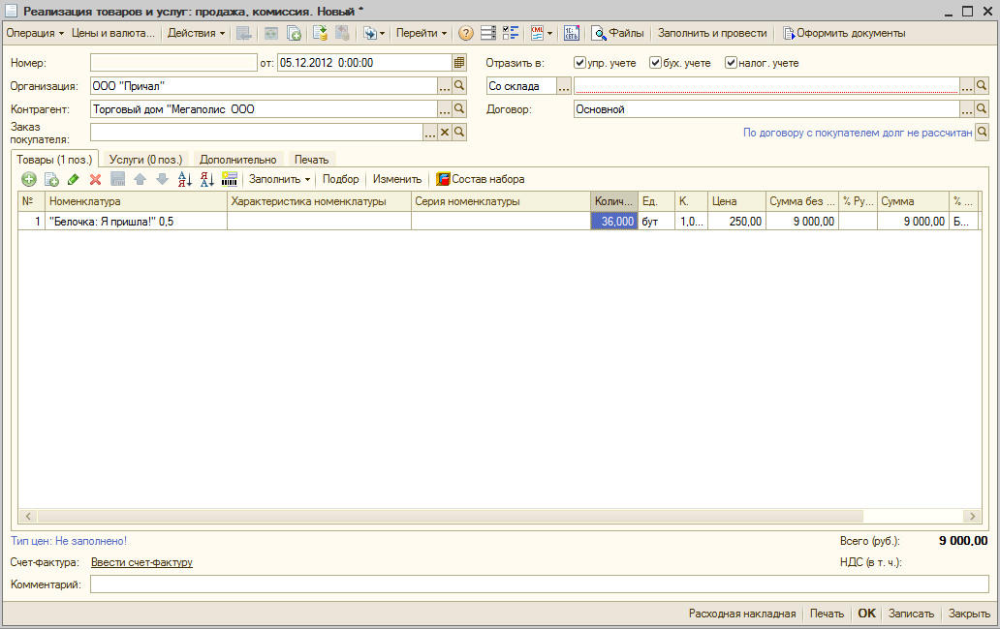
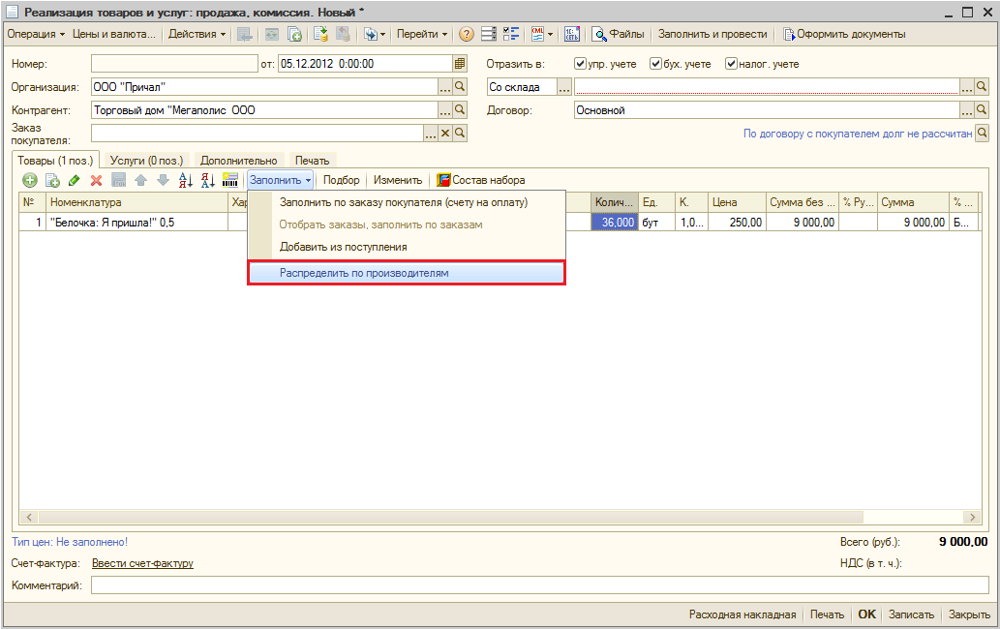
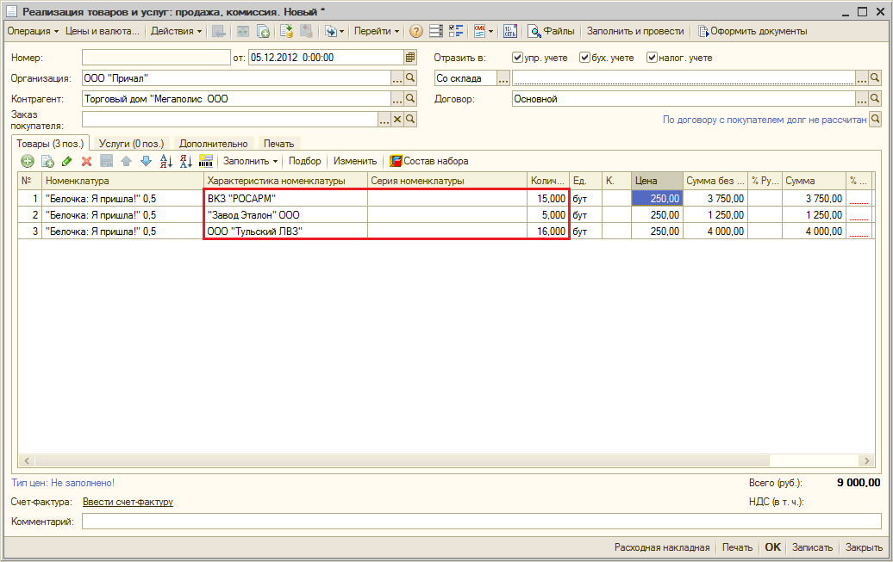

Бонусы
======

#. В стоимость включена поддержка на 2 налоговых периода
#. Обработка "`Заполнение реквизита Объем для базовой единицы измерения из наименования номенклатуры для УТ 10.3 <http://infostart.ru/public/164914/>`_"
#. В поставку включена обработка табличной части "товары" документов реализации. Обработка распределяет по остаткам на складе в разрезе производителей те позиции, для которых производитель не указан. Это удобно в случае, если в текущий момент оформления документов реализации нет возможности определить алкогольная продукция какого именно производителя включена в накладную или товарный чек при розничной продаже.

