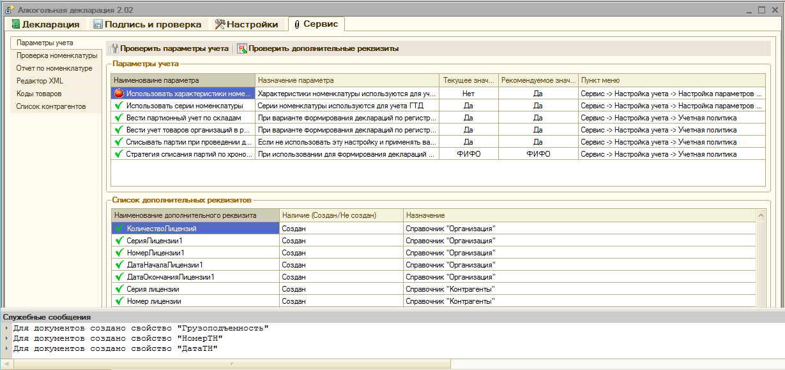
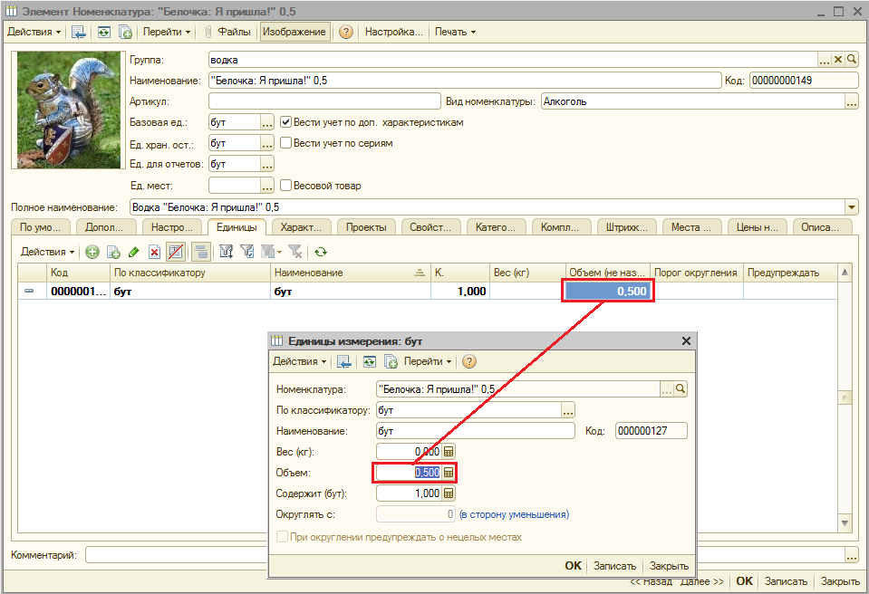
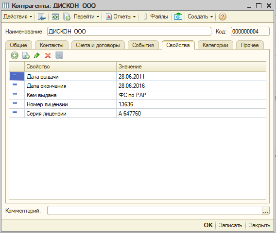

.. _Подготовка-к-работе:

Подготовка к работе
===================

Первый запуск
-------------

При первом запуске отчета, после принятия условий лицензионного соглашения, на экране появится окно сервисного блока со следующим сообщением.

.. figure:: _static/firsrtstart_1.png

Это означает, что до начала работы необходимо сделать определенные настройки. Это касается параметров учета конфигурации, а также дополнительных свойств и характеристик некоторых справочников и документов, в том числе справочников "организации", "контрагенты", "номенклатура"  и  документа "Поступления товаров и услуг" (только для формы 8).

После нажатия кнопки "Да" автоматически запустится модуль проверки параметров учета. В результате проверки для параметров учета (верхняя табличная часть) будут выданы конкретные рекоммендации по настройкам параметров учета и учетной политики необходимых для корректной работы отчета. Для справочников и документов одновременно с проверкой будут создаваться недостающие дополнительные реквизиты (свойства и характеристики).

Чтобы обеспечить правильную работу отчета, необходимо изменить настройки учетной политики и настройки параметров учета так, чтобы они соответствовали рекомендованным. Тоже касается и набора дополнительных реквизитов справочников.

Настройки учетной политики должны быть сделаны Вами вручную, согласно нашим рекомендациям. 

.. Note::
   Модуль *"Проверка параметров"* расположен в блоке *"Сервис"* и всегда может быть использован для проверки готовности конфигурации при работе с отчетом.

Справочник "Номенклатура"
-------------------------

При заполнении справочника "Номенклатура", на закладке "Характеристики" появится характеритика "Производитель", в качестве значений которой можно указывать элементы справочника "Контрагенты".

.. figure:: _static/firsrtstart_3.png

.. Note::
   Использование характеристик номенклатуры, в отличие от серий позволит учетной программе более жестко контролировать остатки при продаже товаров. Например, при проведении документа "Реализация товаров и услуг", или "Отчет о розничных продажах", если для учета в разрезе производителей используются серии номенклатуры, при недостатке товаров на складе будет выдано всего лишь предупреждение о невозможности списания по партиям, однако сам документ будет при этом проведен. В дальнейшем это приведет к накоплению ошибок и трудностях при формировании декларации. Использование характеристик в данной ситуации не позволит проводить документы при недостатке товаров на складе.

.. Warning::
   Чтобы иметь возможность заполнять характеристики номенклатуры, необходимо поставить галочку "Вести учет по доп. характеристикам". Также, если предполагается указывать в таблице 2 приложений 11 и 12 информации по ГТД, необходимо поставить галочки "Вести учет по сериям" и "Вести партионный учет по сериям".

Помимо характеристики "Производитель" необходимо также заполнить свойства номенклатуры:

.. figure:: _static/firsrtstart_4.png

Свойство "Код товара" заполняется из отдельного справочника и служит для отнесения элемента справочника "Номенклатура" к определенному виду алкогольной продукции. Свойство "Производитель по умолчанию" заполняется из справочника "Контрагенты" и служит для того, чтобы при печати и выгрузке приложений алкогольной декларации, в том случае, если не заполнены характеристика номенклатуры, вместо "пустых" производителей подставлялось значение из этого свойства. Это может быть удобно, например, для товаров, по которым уже накоплено достаточно много учетной информации, однако у этого товара единственный производитель. Заполнив это свойство, декларация сформируется правильно, даже, если в документах закупки и продажи указана "пустая" характеристика номенклатуры.

На закладке "Единицы" необходимо указать объем в литрах для базовой единицы измерения (например для бутылки или банки), пересчет в деколитры при формировании декларации будет произведен автоматически.

   
Справочник "Контрагенты"
------------------------

Для поставщиков алкогольной продукции необходимо указать данные о лицензии.

