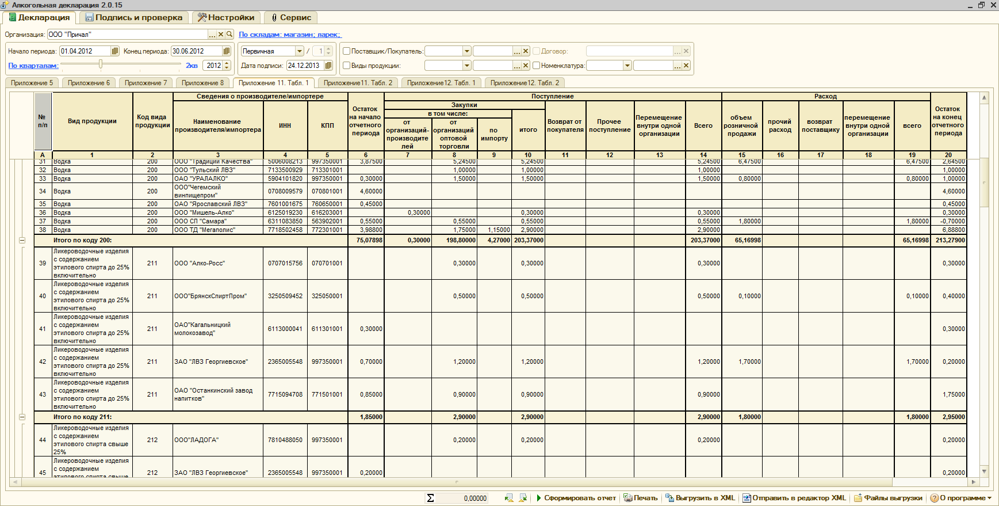
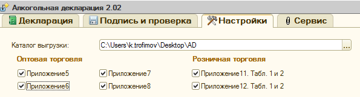
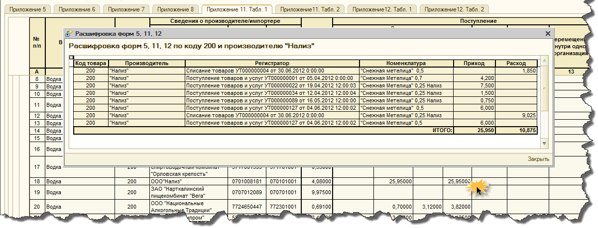
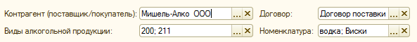
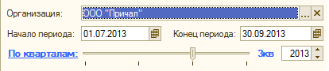
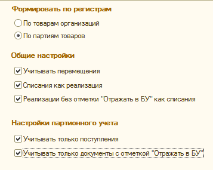
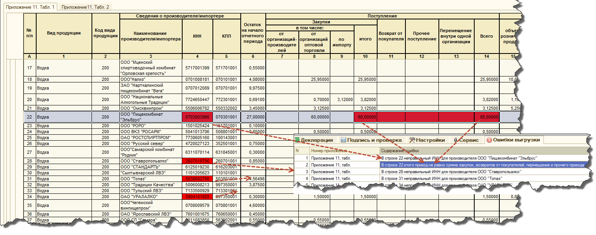
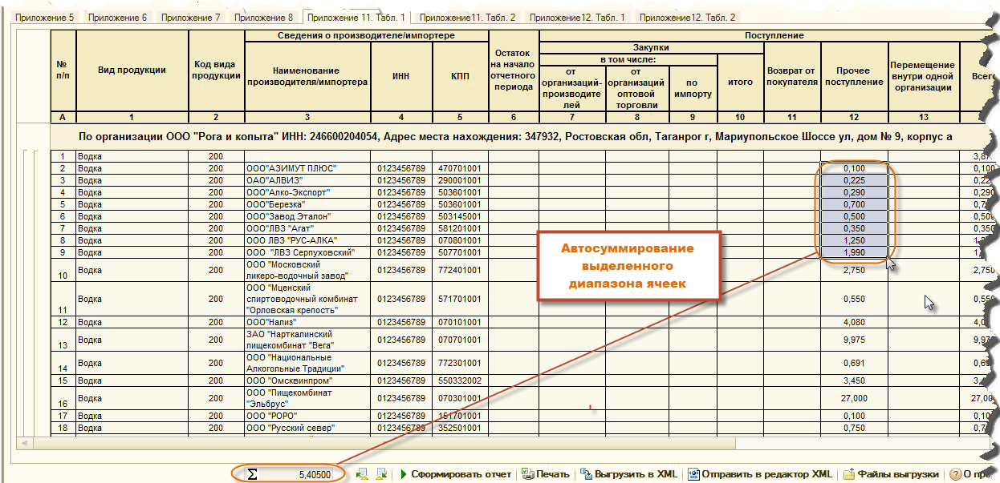
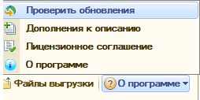

О продукте
==========

Главное окно отчета
-------------------

Возможности отчета
------------------

* **Все наиболее востребованные формы алкогольной декларации - приложения 5, 6, 7, 8, 11 и 12.**  Если нужно еще что-то, пожалуйста сообщите нам об этом

* **Полностью автоматическое заполнение декларации по данным информационной базы.** Вам нужно только правильно организовать учет и мы сделали все чтобы это прошло максимально комфортно (см. пп. 3,4,5).
* **Автоматическая настройка информационной базы для организации учета алкогольной продукции.** При первом запуске обработки  или в любой другой момент времени, когда Вам это понадобится, помощник настройки учета поможет Вам максимально быстро и комфортно настроить Вашу информационную базу для работы с продуктом "Алкогольная декларация".
* **Детализация суммовых показателей отчетов до уровня документа и номенклатуры в один клик.** Не понятно почему в отчете именно такая сумма? Вы можете получить подробную расшифровку любой суммы в отчете и при необходимост открыть и отредактировать непосредственно тот документ или элемент справочника номенклатура который вызвал ваш интерес.

* **Возможность сверок с контрагентами благодаря мощной системе отборов.**
	
 * **Приложение 6.** Отбор по отдельному покупателю или  по группе покупателей, по виду номенклатуры, группе номенклатуры или отдельной номенклатурной позиции;
 * **Приложение 7, приложение 11 (таблица 2) и 12 (таблица 2).** Отборы по отдельному поставщику (контрагенту) или по группе поставщиков, а также отборы по договору,по виду номенклатуры, группе номенклатуры или отдельной номенклатурной позиции;
 * **Приложение 8.** Отборы пока не предусмотрены, но мы готовы реализовать если Вам понадобится.

* **Удобная настройка периода формирования отчетов.**

* **Гибкая система управления источниками данных отчета. Источниками данных в отчете могут быть:**
	
 * записи регистра накопления "Товары организаций";
 * записи регистра *"Партии товаров на складе"*;
 * при формировании отчета по записям регистров накопления, возможно включить или исключить попадание в отчет движений документов "Перемещение товаров", "Списание товаров", а также документов без отметки "отразить в б2х. учете"

* **Мощный XML-редактор, со следующими функциональными возможностями:**

 * **Загрузка и редактирование** ранее выгруженных XML-файлов;
 * **Подгрузка остатков на конец предыдущего отчетного периода** к данным (в виде начальных остатков) текущего отчетного периода с автоматическим пересчетом зависимых показателей. Это позволяет организовать "избирательный" учет т.е. по ограниченному подмножеству учетных данных, содержащихся в информационной базе.
 * **Функция автоматического пересчета зависимых показателей загруженного отчета при редактировании базовых показателей**. Например при редактировании начальных остатков конечные остатки пересчитаются автоматически.
 * **Данные только что сформированного отчета (еще не выгруженного т.е. прямо с экрана монитора) можно передать не только на печать или в файл, но и в редактор XML** для ручного редактирования показателей отчета с последующей выгрузкой данных в формате XML.

* **Комплексная проверка данных отчета при выгрузке данных в файл формата XML (проверка наличия кода вида продукции, наличия производителя, правильности ИНН и КПП, проверка соотношений контрольных показателей отчета).** При обнаружении ошибок выгрузка файла не производится, а найденные ошибки подсвечиваются красным цветом.

* Подпись, шифрование и проверка файлов декларации аналогично сервисам ФСРАР. Сформированные файлы можно проверить на соответствие формату ФСРАР, подписать и зашифровать. У вас не будет необходимости приобретать такие программы как Crypto АРМ, все доступно с одного рабочего места.

* Автоматическое суммирование выделенного диапазона ячеек в таблицах отчетных форм. Если Вы выделите произвольный диапазон числовых данных в любой из сформированных отчетных форм, то в специально отведенном поле всегда можно увидеть арифметическую сумму выделенных данных (см. рисунок ниже)

* Работает с базовыми версиями. Обработка не требует внесения изменений в конфигурацию и может работать с базовыми версиями, существенно сокращая стоимость внедрения при использовании не более одного рабочего места.

* Модуль автоматического обновление отчета через интернет. Проверка обновлений может осуществляться как по желанию пользователя (в полуавтоматическом режиме), так и при каждом запуске программы.

